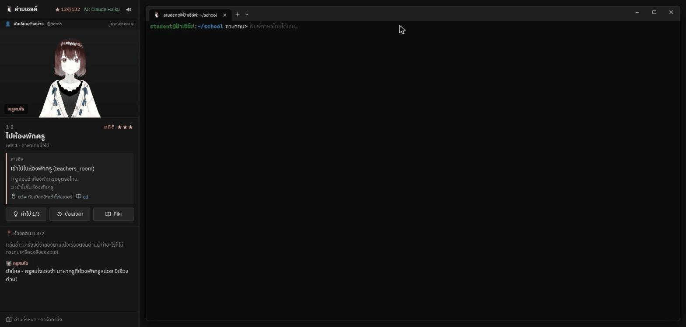
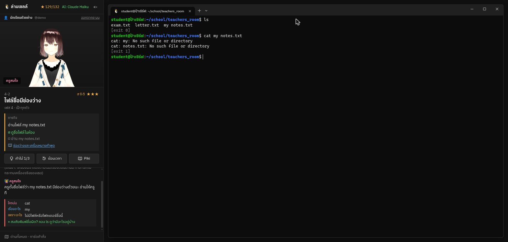
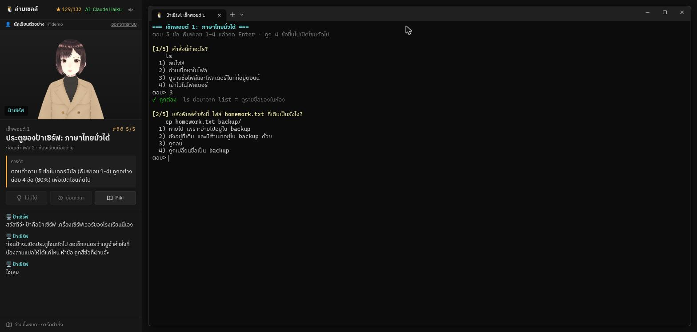
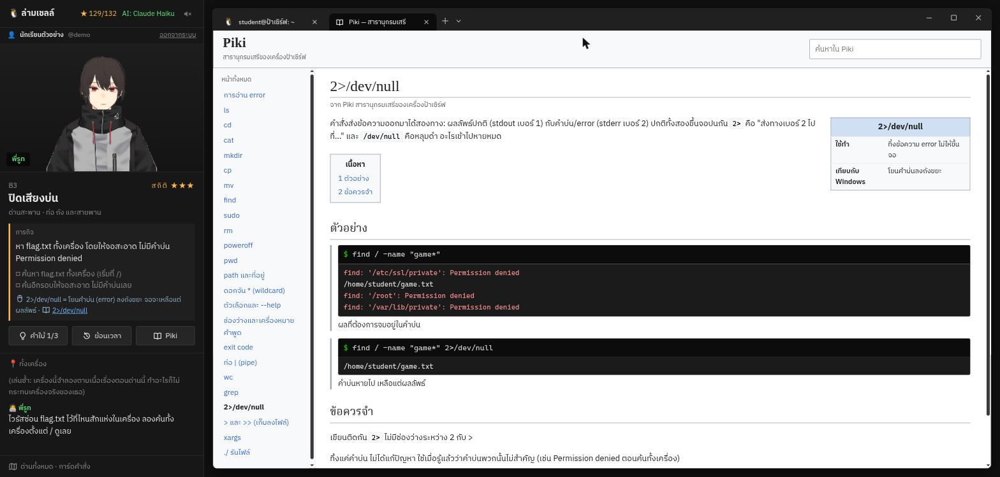
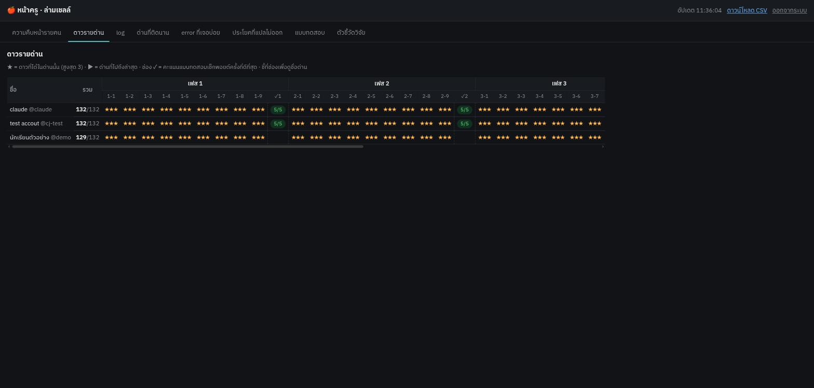

# ล่ามเชลล์ (LamShell)

[English](README.md) · **เล่นออนไลน์: https://cjpsms.github.io/lamshell/** (โหมดพจนานุกรม ไม่บันทึกความคืบหน้า)

**เกมสอนใช้ terminal Linux สำหรับนักเรียนมัธยมไทย** เริ่มจากพิมพ์ภาษาไทยมั่วๆ ได้เลย แล้วตัวช่วยจะค่อยๆ
ถอยออกไปทีละเฟส จนผู้เล่นพิมพ์คำสั่งจริงและอ่าน error ออกเองได้ เล่นในเบราว์เซอร์ พิมพ์ผิดได้ไม่มีวันพัง



## แก้ปัญหาอะไร

เกมสอน terminal ที่มีอยู่ (GameShell, OverTheWire Bandit, Terminus ฯลฯ) มีสองแบบ แบบแรกบังคับพิมพ์ syntax
ให้ถูกตั้งแต่ด่านแรก เด็กที่ไม่เคยเห็นหน้าจอดำจะติดตั้งแต่เริ่ม แบบที่สองใจดีตลอดเกมแต่ไปไม่ถึงคำสั่งจริง
และไม่มีเกมไหนรับภาษาไทยเลย

ล่ามเชลล์ใช้คำสั่งหลักชุดเดิม 10 ตัว (`ls cd mkdir cp mv rm cat find sudo poweroff`) วนกลับมาทุกเฟส
แต่ความเข้มของการพิมพ์ค่อยๆ เพิ่มขึ้น จากภาษาแม่ไปสู่ syntax จริง:

| เฟส | พิมพ์อะไรได้ | น้องล่าม (ล่ามเพนกวิน) ช่วยแค่ไหน |
|---|---|---|
| 1 | ภาษาไทยมั่วๆ เช่น `ปิดคอมดิ` | แปลเป็นคำสั่งจริง โชว์ให้ดู แล้วรันให้ |
| 2 | ถามเป็นไทย แล้วพิมพ์คำสั่งเอง | สอนทุกส่วนของคำสั่ง แต่ไม่รันให้ |
| 3 | ชื่อคำสั่งจริง + ส่วนที่เหลือเป็นไทย เช่น `ls ไฟล์ที่ซ่อนอยู่` | แปลแค่ "ไส้ใน" และให้ดูก่อนลบทุกครั้ง |
| 4 | syntax เป๊ะทุกตัว | ไม่มีคนแปล เหลือสมุดถอดรหัส error หลังปุ่ม |
| ด่านสะพาน | `\|` `2>/dev/null` `>` `xargs` | ไม่มี |
| กู้ภัย + บทสุดท้าย | งานจริง `sudo` `./script` ดูก่อนลบ | ไม่มี |

**จุดขาย: เราไม่ได้สอนคำสั่ง เราสอนให้อ่าน error เป็น** ข้อความ error ทุกตัวในเกมตรงกับ GNU coreutils / bash จริง
แยกเป็น *ใครบ่น / บ่นเรื่องอะไร / เพราะอะไร* พร้อมคำอธิบายภาษาไทยที่ค่อยๆ หายไปตามเฟส

## ภาพจากเกม

| | |
|---|---|
|  |  |
| **เฟส 4** พิมพ์เป๊ะทุกตัว เห็น error แบบเครื่องจริง เปิดสมุดถอดรหัสได้ | **แบบทดสอบเช็กพอยต์** ท้ายเฟส 1-4 ต้องได้ 80% ถึงผ่าน |
|  |  |
| **Piki** สารานุกรมคำสั่งในเกม (ล้อ Wikipedia) | **หน้าครู** ความคืบหน้า ดาวรายด่าน และ log ของทุกคน |

## มีอะไรในเกม

- **44 ด่านพร้อมเนื้อเรื่อง** ปี 2050 น้องล่ามอยู่ในคอมทุกเครื่อง จนไวรัสมั่วซั่วบุกเครื่องเซิร์ฟเวอร์ของโรงเรียน
  ผู้เล่นต้องไล่ไวรัส ช่วยครูสมใจ แล้วไปกู้น้องล่ามที่ถูกขัง มีฉากเล่าเรื่อง 3D และเสียงพากย์บทพูดหลักทุกบท
- **เครื่องเดียวทั้งเกม** ทุกอย่างที่ผู้เล่นทำติดตัวไปด่านต่อไป ความทรงจำของน้องล่ามเขียนจากสิ่งที่ผู้เล่นพิมพ์จริง
  และถ้าลบสมองน้องล่ามทิ้ง = GAME OVER (เหมือนเครื่องจริง rm ไม่มีถังขยะ)
- **ตรวจผ่านจากสภาพของเครื่อง** ไม่ได้เทียบตัวอักษร คำตอบที่ถูกจึงมีได้หลายแบบ
- **ตัวช่วย 3 ขั้น** ลุงภารโรงบอกคำสั่งที่ต้องใช้ → สมุดน้องล่ามถอดรหัส error → พี่รูทเฉลย (ขั้นสูงขึ้นดาวลดลง)
- **เทียบกับ Windows** ด่านที่มีเรื่องใหม่มีประโยคเทียบกับสิ่งที่เด็กคุ้น เช่น `sudo` = Run as administrator
- **Piki** คู่มือ 24 หน้า แบ่งตามคำสั่ง อ่านแล้วทำได้ทุกด่านแต่ไม่ใช่เฉลย เพราะตัวอย่างใช้ไฟล์คนละชุดกับในด่าน
- **บัญชีนักเรียน** สมัครด้วยชื่อผู้ใช้และรหัสผ่าน (เก็บเป็น hash) ต้องกดยอมรับการเก็บข้อมูลก่อน เล่นต่อจากเครื่องไหนก็ได้
- **หน้าครู** (`/teacher`) ความคืบหน้ารายคน (ใครติดด่านเดิมเกิน 5 นาทีขึ้นเตือน), ดาวรายด่าน, log ทุกอย่างที่พิมพ์,
  ด่านที่ติดนาน, error ที่เจอบ่อย, ประโยคไทยที่แปลไม่ออก, ผลแบบทดสอบรายข้อ, ดาวน์โหลด CSV
- **ตัวชี้วัดสำหรับวิจัย** อัตรา error ซ้ำ, อัตราพึ่งตัวแปล, อัตราเปิดสมุดถอดรหัส, อัตราดูก่อนลบ ใช้ตอบคำถามว่า
  การเริ่มจากภาษาแม่แล้วค่อยๆ ถอดออก ช่วยให้พิมพ์ syntax จริงและอ่าน error ได้ดีขึ้นจริงไหม

## วิธีเล่น

**ออนไลน์:** https://cjpsms.github.io/lamshell/ เล่นได้ทั้งเกมในเบราว์เซอร์ ไม่ต้องมีเซิร์ฟเวอร์ ภาษาไทยแปลด้วย
พจนานุกรมในตัวเกม (ประโยคทั่วไปอย่าง "ดูไฟล์" "เข้าห้องพักครู" "ก๊อปการบ้านไปไว้ใน backup") และความคืบหน้าเก็บไว้ใน
เบราว์เซอร์นั้น ส่วนบัญชีนักเรียน หน้าครู และการแปลด้วย AI ต้องรันเซิร์ฟเวอร์บนเครื่อง

**รันบนเครื่อง** (เวอร์ชันเต็ม): ต้องมี Python 3 แล้วสั่ง

```
./lamshell            # ครั้งแรกจะถามการตั้งค่าใน terminal แล้วเปิดเกมในเบราว์เซอร์
./lamshell --setup    # รหัสครู / เปิดให้เครื่องนักเรียนในห้องเข้าได้ / พอร์ต / AI ที่ใช้แปลภาษาไทย
# เกม: http://127.0.0.1:4011   หน้าครู: http://127.0.0.1:4011/teacher
```

เลือก AI ที่ใช้แปลภาษาไทยได้ตอนตั้งค่า: [Claude Code](https://claude.com/claude-code) CLI (ค่าเริ่มต้น ไม่ต้องใช้ API key),
Anthropic API (`pip install anthropic`), OpenAI, Google Gemini หรือ OpenRouter (ใช้ API key ของค่ายนั้น)
ถ้าไม่มี AI ที่ใช้ได้ เกมจะใช้พจนานุกรมในตัวแทน จึงเล่นได้เสมอ

รหัส sudo ในเกม: `pass123` · การตั้งค่าอยู่ใน `config.json` (รหัสครูเก็บเป็น hash และมีค่าย AI กับ key) และข้อมูลการเล่นอยู่ใน
`data/lamshell.db` ทั้งสองอย่างไม่อยู่ใน repo

## โครงสร้าง

| ไฟล์ | หน้าที่ |
|---|---|
| `static/js/shell.js` | ตัวจำลอง bash ที่เขียนเอง (pipe, redirect, glob, quote, sudo) บนระบบไฟล์ในหน่วยความจำ ข้อความ error ตรงกับ GNU coreutils 9.4 / bash 5.2 |
| `static/js/levels.js` · `world.js` | 44 ด่าน เครื่องเริ่มต้น และสิ่งที่เนื้อเรื่องเพิ่มเข้ามาในแต่ละด่าน |
| `static/js/game.js` | การรับคำสั่งตามเฟส ดาว คำใบ้ ตัวถอดรหัส error |
| `static/js/quiz.js` · `piki.js` | แบบทดสอบเช็กพอยต์ · สารานุกรม Piki |
| `static/js/stage.js` · `cutscene.js` | ตัวละคร 3D (three.js + three-vrm) และฉากเล่าเรื่อง |
| `server.py` · `providers.py` | เซิร์ฟเวอร์ Python (stdlib ล้วน) ส่งคำขอแปลให้ AI ที่เลือกไว้ และมีตัวกันไม่ให้ AI เติม `sudo` เติมขั้นตอน หรือเปลี่ยนคำสั่งที่ผู้เล่นเลือก |
| `static/js/offline.js` | พจนานุกรมในตัวเกม ใช้เมื่อไม่มี AI (เวอร์ชันออนไลน์) |
| `classroom.py` · `settings.py` | บัญชีนักเรียน หน้าครู ข้อมูลวิจัย (SQLite) · การตั้งค่าใน terminal |

ประวัติการพัฒนาและเหตุผลของการตัดสินใจแต่ละครั้งอยู่ใน [CHANGELOG.md](CHANGELOG.md)

## ยังไม่ได้ทำ

ตอนจบพิเศษ "ลองบน Linux จริง" (v86 รัน Linux ในเบราว์เซอร์)

ซอร์สโค้ดเปิดให้ดูได้เพื่อการตรวจสอบ © 2026 cjpsms สงวนลิขสิทธิ์ จะเพิ่มไลเซนส์หลังจบการแข่งขัน

## เครดิต

- ออกแบบเกมและเนื้อเรื่อง: cj ([github.com/cjpsms](https://github.com/cjpsms))
- ตัวละคร 3D: cj สร้างใน VRoid Studio จากโมเดลตัวอย่างของ VRoid (ข้อตกลง VRoidPreset A-Z: ใช้ได้อิสระ ไม่ใช่ CC0)
- เสียงพากย์: ElevenLabs (ป้าเซิร์ฟใช้เสียงจาก Gemini TTS) · ฟอนต์ IBM Plex Sans Thai และ Cascadia Mono
